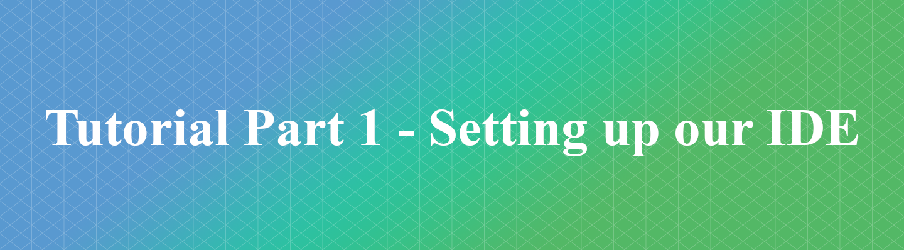

Welcome to the first step in this tutorial series where we introduce games programming using HTML5 and Javascript.

The first step in this series is to familiarise yourself a little bit with the development tools we will be using and to write our first few lines of code. The following video will demonstrate how to get set up using [Visual Studio Code](https://code.visualstudio.com/) as our Integrated Development Environment (IDE).

## Setting up our Development Environment

## Further Tasks

Now that the VS Code is set up, you could familiarise yourself with some more HTML syntax prior to undertaking the next stage of this activity series.  

Try putting the following code snippets into your index.html and seeing what the results are.

#### Headings and Paragraphs
```html
<!DOCTYPE html>
<html>
<body>
<h1>My First Heading</h1>
<p>My first paragraph.</p>
</body>
</html>
```
#### Titles

```html
<!DOCTYPE html>
<html>
<head>
<title>Title of the document</title>
</head>
<body>The content of the document......</body>
</html>
```

#### Tables

```html
<!DOCTYPE html>
<html>
<body>
<table border="1">
<tr>
<td>row 1, cell 1</td>
<td>row 1, cell 2</td>
</tr>
<tr>
<td>row 2, cell 1</td>
<td>row 2, cell 2</td>
</tr>
</table>
</body>
</html>
```

#### Lists

```html
<!DOCTYPE html>
<html>
<body>
<ul><li>Coffee</li><li>Milk</li></ul>

<ol><li>Coffee</li><li>Milk</li></ol>

<dl>
<dt>Coffee</dt><dd>- black hot drink</dd>
<dt>Milk</dt><dd>- white cold drink</dd>
</dl>

</body>
</html>

```

## Contact Points
If you have any sticking points on this tutorial or questions feel free to email those through to:

- **Jamie Stewart** : [jstewart2@glos.ac.uk](mailto:jstewart2@glos.ac.uk)
