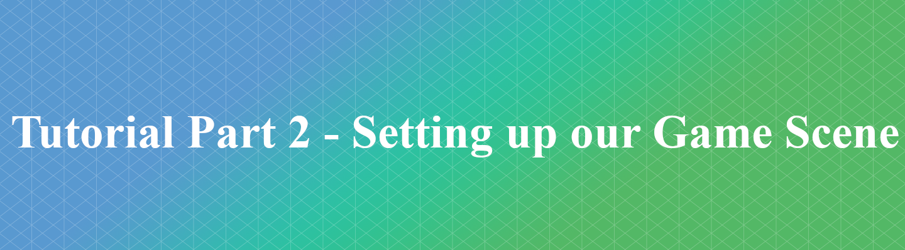

Continuing on with our tutorial series from where [tutorial 02](https://github.com/uniglos/CGP_Actvity/tree/master/tutorial_02) left off, this tutorial will introduce an implementation of getting the ball from Pong set up and moving around or canvas.

This tutorial will introduce: 
- using variables and operations upon those variables
- simple drawing of filled shapes 
- basic collision detection (we will keep the ball inside the bounds of the screen)

Follow along with the video tutorial below to get the ball rolling... (*I am so sorry for that pun*).

## Setting up the game scene

## Further Tasks

Once you've finished this tutorial move on to [Tutorial Part 3](https://github.com/uniglos/CGP_Activity/tree/master/tutorial_03)

## Contact Points
If you have any sticking points on this tutorial or questions feel free to email those through to:

- **Jamie Stewart** : [jstewart2@glos.ac.uk](mailto:jstewart2@glos.ac.uk)